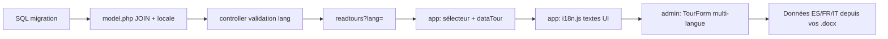

# Internationalisation de `SITIO_BARCELONA` (EN par défaut, ES, FR, IT)

Voici une approche alignée sur l’architecture actuelle (PHP + MySQL, front en modules JS). Aujourd’hui, `title` et `summary` sont directement dans `BT_Tour` ; il faut les sortir par langue tout en gardant prix, durée et statut communs au tour.

## Principe général

Séparer deux types de contenu :

| Type | Exemples | Où les stocker |
|------|----------|----------------|
| **Données métier** (éditables en admin) | Titre et résumé des tours (éventuellement monuments) | Base de données, **une ligne par langue** |
| **Interface fixe** | Nav, intro, titres de sections, formulaire contact | Fichiers JS de traduction côté front |

Langues supportées : `en` (défaut), `es`, `fr`, `it`.

---

## 1. Schéma base de données (recommandé)

Garder `BT_Tour` pour ce qui ne change pas selon la langue, et ajouter une table de traductions :

```sql
-- BT_Tour : données communes
CREATE TABLE BT_Tour (
  id INT AUTO_INCREMENT PRIMARY KEY,
  duration VARCHAR(60) NOT NULL,   -- optionnel : déplacer en traduction si "2h" / "2 horas"
  price DECIMAL(8,2) NOT NULL,
  is_active TINYINT(1) NOT NULL DEFAULT 1
);

-- Nouvelle table
CREATE TABLE BT_Tour_Translation (
  tour_id INT NOT NULL,
  locale CHAR(2) NOT NULL,  -- 'en', 'es', 'fr', 'it'
  title VARCHAR(120) NOT NULL,
  summary TEXT NOT NULL,
  PRIMARY KEY (tour_id, locale),
  FOREIGN KEY (tour_id) REFERENCES BT_Tour(id) ON DELETE CASCADE
);
```

**Migration** depuis l’état actuel :

1. Créer `BT_Tour_Translation`.
2. Pour chaque tour existant : `INSERT` avec `locale = 'en'` et les `title` / `summary` actuels.
3. Retirer `title` et `summary` de `BT_Tour` (ou les laisser temporairement le temps de migrer).

Même logique possible plus tard pour `BT_Monument` -> `BT_Monument_Translation` (`name`, `description`).

---

## 2. API PHP (`model.php` + `controller.php`)

**Lecture publique** — ajouter un paramètre `lang` :

```php
// readtours ?lang=fr
function getActiveTours($locale = 'en') {
    $sql = '
        SELECT t.id, tr.title, t.duration, t.price, tr.summary
        FROM BT_Tour t
        JOIN BT_Tour_Translation tr ON tr.tour_id = t.id AND tr.locale = :locale
        WHERE t.is_active = 1
        ORDER BY t.id DESC';
    // ...
}
```

**Fallback** : si la traduction manque, refaire une requête avec `locale = 'en'` (ou un `LEFT JOIN` + `COALESCE`).

**Admin** — deux options :

- **Option A** : `admintours` renvoie tous les tours avec **toutes** les langues (objet du type `{ id, price, translations: { en: {...}, es: {...} } }`).
- **Option B** : `admintours&lang=fr` ne renvoie qu’une langue ; l’admin change d’onglet et recharge.

Pour **création / mise à jour** :

- `addtour` : insérer dans `BT_Tour`, puis 4 lignes dans `BT_Tour_Translation` (au minimum `en` obligatoire).
- `updatetour` : mettre à jour `BT_Tour` + `UPDATE BT_Tour_Translation` pour **une** `locale` envoyée dans le formulaire (`locale=fr`).

Valider `locale` dans le contrôleur : uniquement `en|es|fr|it`.

---

## 3. Site public (`app/`)

### Sélecteur de langue

Dans la barre de navigation, ajouter un `<select>` ou des boutons `EN | ES | FR | IT`.

```javascript
// Exemple dans app/index.html ou un petit module i18n.js
const SUPPORTED = ['en', 'es', 'fr', 'it'];
let currentLang = localStorage.getItem('lang') || 'en';
if (!SUPPORTED.includes(currentLang)) currentLang = 'en';
```

### Appels API

Dans `app/data/dataTour.js` :

```javascript
DataTour.requestAll = async function (lang) {
  let answer = await fetch(HOST_URL + "?todo=readtours&lang=" + encodeURIComponent(lang));
  return answer.json();
};
```

Au changement de langue :

1. Mettre à jour `localStorage`.
2. Recharger tours (et monuments si traduits).
3. Re-rendre les textes statiques via un dictionnaire.

### Textes statiques (intro, nav, sections)

Fichier du type `app/data/i18n.js` :

```javascript
export const I18N = {
  en: { navIntro: 'Intro', sectionTours: 'Proposed Tours', ... },
  es: { navIntro: 'Inicio', sectionTours: 'Visitas propuestas', ... },
  fr: { ... },
  it: { ... },
};
```

`V.renderIntro()`, `NavBar.format()`, etc. utilisent `I18N[currentLang]` au lieu de chaînes en dur dans `index.html`.

Mettre à jour `<html lang="...">` dynamiquement.

---

## 4. Admin — édition indépendante par langue

Dans `TourForm`, pour **chaque** tour, afficher 4 blocs (onglets ou accordéon) :

```txt
[ EN ] [ ES ] [ FR ] [ IT ]
  Title:    [____________]
  Summary:  [____________]
  [ Update tour (FR) ]   <- bouton envoie id + locale=fr + title + summary
```

Champs communs **une seule fois** par tour : prix, durée, actif/inactif.

Structure du formulaire d’édition :

- Champs globaux : `price`, `duration`, `is_active`
- Par langue : `title`, `summary` + champ caché `locale`

Le handler `handlerUpdateTour` envoie déjà un `FormData` ; il suffit d’y inclure `locale` et d’adapter `updateTourController` pour ne mettre à jour que la traduction concernée (et `BT_Tour` pour prix/durée/statut).

Pour **ajouter** un tour : formulaire avec 4 onglets de texte + un seul prix/durée ; le PHP crée 1 tour + jusqu’à 4 traductions.

---

## 5. Ordre de mise en oeuvre suggéré



1. Migration SQL + seed `en` depuis `BARCELONA_GUIDE_data.sql`.
2. Backend : `readtours`, `admintours`, `addtour`, `updatetour` avec `locale`.
3. Front public : sélecteur + `lang` dans les fetch + `i18n.js`.
4. Admin : onglets par langue dans `row-template.html` / `script.js`.
5. Saisie des traductions ES/FR/IT (vous avez déjà des sources dans le ZIP mentionné dans le SQL).

---

## 6. Points d’attention

- **Durée** : si vous voulez "1h30" / "1h 30" / "1h 30" en italien, mettez `duration` dans `BT_Tour_Translation` aussi.
- **Messages contact** : restent dans la langue du visiteur ; pas besoin de les traduire en base.
- **Réponses API** (`addMessageController`) : messages d’erreur/succès peuvent aussi passer par `i18n.js` côté client, ou un paramètre `lang` côté PHP.
- **SEO** (optionnel) : URLs du type `?lang=fr` ou `/fr/` pour partager un lien dans une langue donnée.

---

## Résumé

| Couche | Changement principal |
|--------|----------------------|
| **MySQL** | Table `BT_Tour_Translation` ; `title`/`summary` par `(tour_id, locale)` |
| **PHP** | Paramètre `lang` / `locale` ; JOIN + fallback `en` |
| **app/** | Sélecteur langue + `readtours&lang=` + fichier `i18n.js` |
| **admin/** | Formulaire par tour avec 4 jeux de champs texte + `locale` à l’update |

C’est l’approche la plus propre pour votre stack : l’admin modifie chaque langue séparément, le site affiche la bonne version, et l’anglais reste le défaut si une traduction manque.
